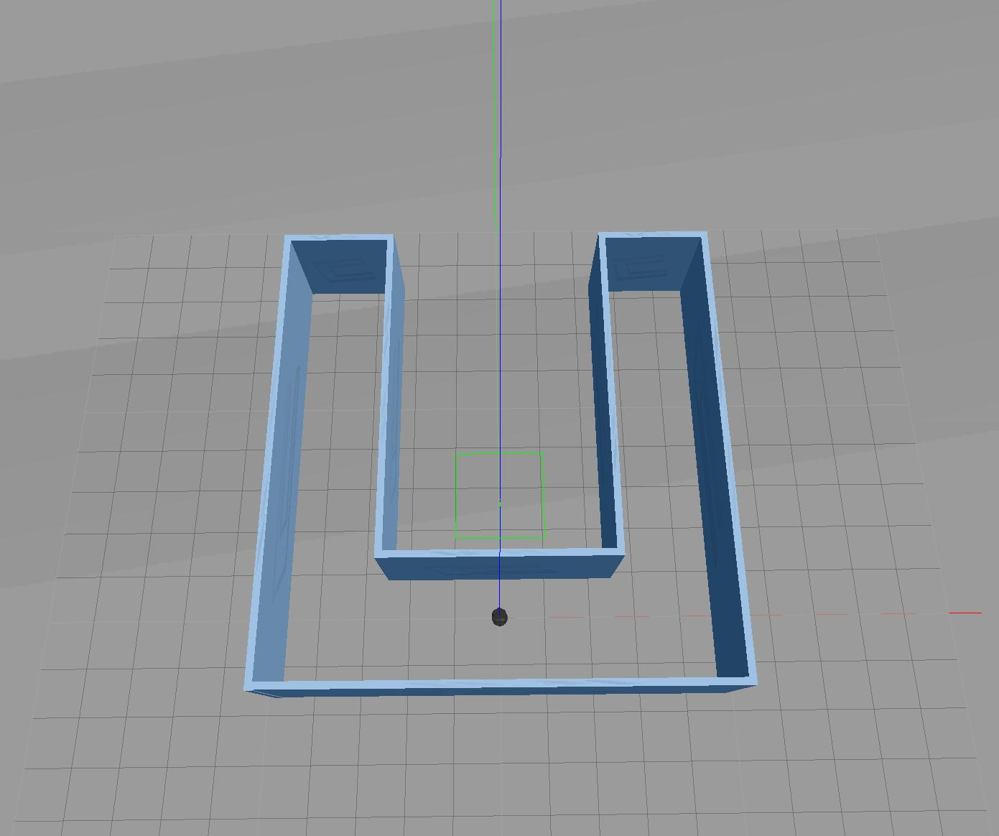

# Final Project - Home Service Robot

This project aims to build a Home Service Robot in ROS.

## Setup

The project was developed and run on the [Robotics Engineering Nano Degree VMware virtual machine](https://s3-us-west-1.amazonaws.com/udacity-robotics/Virtual+Machines/Lubuntu_071917/RoboVM_V2.1.0.zip) from the [Part 1 - Lesson 6](https://classroom.udacity.com/nanodegrees/nd209/parts/0778207d-f34a-4178-8ccf-9e06b5bd2203/modules/5d87733b-d153-475c-819a-3ee67aac986a/lessons/e0c61e8d-7eac-4807-8737-d2bd321ae7a2/concepts/e8451596-f9a4-4ac3-8aca-e40d7d60efcc).
This image runs Ubuntu 16.04.7 LTS ([Xenial Xerus](http://releases.ubuntu.com/16.04/)).

Installed `xterm` to be consistent with the project description of a launch shell script. For all other interaction, `terminator` was used.

### ROS

The Robot Operating System ([ROS](https://www.ros.org/about-ros/)) is a framework to develop robotic solutions.
This projects runs on ROS version [Kinect Kame](https://wiki.ros.org/kinetic).

#### Development setup

ROS development reside in a [catkin workspace](https://wiki.ros.org/catkin/workspaces).

##### Initialize workspace:
```shell
$ mkdir src && cd src
$ catkin_init_workspace
$ cd ..
$ catkin_make
```

##### Install required packages:
```shell
$ cd src
```

###### [gmapping](https://wiki.ros.org/gmapping)
Provides Simultaneous Localization and Mapping (SLAM) capabilities to a robot equipped with laser range finder and camera sensors.

```shell
$ git clone -b hydro-devel https://github.com/ros-perception/slam_gmapping
```

###### [turtlebot_teleop](https://wiki.ros.org/turtlebot_teleop)
Provides robot keyboard teleoperation

```shell
$ git clone -b kinetic https://github.com/turtlebot/turtlebot
```

###### [turtlebot_rviz_launchers](https://wiki.ros.org/turtlebot_rviz_launchers)
Rviz preconfigured visualization loader for TurtleBot.

```shell
$ git clone -b indigo https://github.com/turtlebot/turtlebot_interactions
```

###### [turtlebot_gazebo](https://wiki.ros.org/turtlebot_gazebo)
Gazebo launcher for TurtleBot.

```shell
$ git clone -b indigo https://github.com/turtlebot/turtlebot_simulator
```

##### Configure packages

```shell
$ cd ..
$ catkin_make
```

##### Create directories

```shell
$ mkdir src/map
$ mkdir src/scripts
$ mkdir src/rvizConfig
$ mkdir src/pick_objects
$ mkdir src/add_markers
```

### TurtleBot

### Rviz

### Gazebo

[Gazebo](http://gazebosim.org/) is a 3D simulation environment aimed to robot systems development and testing.

Setup and tests are run on the basic shape building from [Part 2 - Lesson 1](https://classroom.udacity.com/nanodegrees/nd209/parts/852e258d-b6c9-4823-b0af-0a7f77379583/modules/8a9ec5d0-dbd1-4f9b-80c5-c01a46aee151/lessons/9b7f4396-2279-4c4b-a785-4142bd00ad8c/concepts/00f1b2c7-0fe6-4bad-9bf6-79efb1a9070d).




### Test SLAM

Start Gazebo with a TurtleBot in the basic building world with `turtlebot_world.launch`.

Run Simultaneous Localization and Mapping (SLAM) with `gmapping_demo.launch` and visualize it with `view_navigation.launch`.

Operate the TurtleBot with the keyboard with `keyboard_teleop.launch`.

```shell
$ source devel/setup.bash
$ ./test_slam.sh
```


#### Save map

Navigate the map until a sufficient detailed map is build:


Save the map:
```shell
$ rosrun map_server map_saver -f src/map/test_map
```

### Test Navigation

Start Gazebo with a TurtleBot in the basic building world with `turtlebot_world.launch`.

Run Adaptive Monte Carlo Localization (AMCL) with `amcl_demo.launch`.

Visualize and control, through 2D goals, navigation with `view_navigation.launch`.


### Navigation Goal Node

Create new `pick_objects` package:
```shell
$ catkin_create_pkg pick_objects move_base_msgs actionlib roscpp
```

Add a new `pick_objects_node.cpp` file to implement navigation goal node.
This node sends two goals to ROS Navigation Stack and wait 5 seconds between these two commands.
It will interact with the [`move_base` package](https://wiki.ros.org/move_base) that implements an [Action](https://wiki.ros.org/actionlib) that given a goal will try to reach it.

Change `CMakeLists.txt` to include the new file.
```cmake
include_directories(${catkin_INCLUDE_DIRS})
add_executable(${PROJECT_NAME}_node src/pick_objects_node.cpp)
target_link_libraries(${PROJECT_NAME}_node ${catkin_LIBRARIES})
```

Add the new node to the Navigation test script.


### Visualization Markers

Create new `add_markers` package:
```shell
$ catkin_create_pkg add_markers roscpp visualization_msgs
```

Change `CMakeLists.txt` to include the new file.
```cmake
include_directories(${catkin_INCLUDE_DIRS})
add_executable(${PROJECT_NAME}_node src/add_markers_node.cpp)
target_link_libraries(${PROJECT_NAME}_node ${catkin_LIBRARIES})
```

This node requires the Rviz [Marker](https://wiki.ros.org/rviz/DisplayTypes/Marker) display.
Added this display to the navigation configuration and saved this new configuration.

Add the new node to the Navigation test script and replace the `view_navigation.launch` with the new `view_navigation_marker.launch`.


## Home Service Robot

Robot will pick up an object at a position and drop it off in another position.

The following ROS Parameters configure this mission. All coordinates are from the `map` reference:
| Parameter | Type | Description |
|-----------|------|-------------|
| /pick_objects/pick_up_x | float | Pick up X position |
| /pick_objects/pick_up_y | float | Pick up Y position |
| /pick_objects/drop_off_x | float | Drop off X position |
| /pick_objects/drop_off_y | float | Drop off Y position |

`add_markers` node simulates object pick up and drop off by implementing two services:
| Service | Description |
|---------|-------------|
| /add_markers/pick_object | Pick up object from position |  
| /add_markers/drop_object | Drop off object at position |

defined by `AddMarkersObject.srv`:
```
float32 x
float32 y
---
bool success
string message
```

`pick_objects` sequence:
1. Drop off object at pick up position (call `/add_markers/drop_object` service)
2. Drive robot to pick up position (call `move_base` action)
3. Pick up object when position is reached (call `/add_markers/pick_object` service)
4. Drive robot to drop off position (call `move_base` action)
5. Drop off object when position is reached (call `/add_markers/drop_object` service)

Home Service Robot nodes and connections:


`pick_objects` reads parameters from `rosparam`, calls `move_base` action and `add_markers` services.

`add_markers` publishes messages to `rviz`.

### add_markers

Change `CMakeLists.txt` to include the `srv` file.
```cmake
find_package(catkin REQUIRED COMPONENTS roscpp message_generation visualization_msgs)
add_compile_options(-std=c++11)
add_service_files(FILES AddMarkersObject.srv)
generate_messages(DEPENDENCIES visualization_msgs)
``` 

Change `package.xml` to include message generation build dependency: 
```xml
  <build_depend>message_generation</build_depend>
  <exec_depend>message_runtime</exec_depend>
```

### Example run

Robot navigate to pick up position:


Robot pick up the object:


Robot navigate to drop off position:


Robot drop off the object:


### Pick Object update

The Home Service implementation of the `pick_objects` node requires ROS parameters. The startup localization and navigation script was updated to match this requirement.